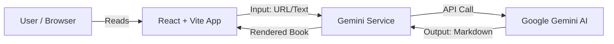

# ZenReader: The Project Guide
*(Or: How we built a Babel Fish for your attention span)*

Welcome to ZenReader. If you're reading this, you're either a new contributor, a future version of myself trying to remember what I did, or just curious. This document isn't a boring spec sheet; it's the specific story of *what* this thing is, *how* we built it, and the *bruises* we got along the way.

---

## 📖 The Vision: What *is* this?

We live in a world of high-noise content. YouTube videos that ramble, podcasts that drift, and articles that bury the lead.

**ZenReader is a filter.**

It takes messy input—long YouTube videos, raw transcripts, or pasted text—and uses Google's Gemini AI to "ghostwrite" it into a high-quality, distraction-free book chapter. It doesn't just summarize; it *rewrites*. It turns "Um, so, yeah, like subscribe guys" into "The fundamental principle of thermodynamics suggests..."

It is your personal AI editor, turning the internet's noise into signal.

---

## 🏗️ The Architecture: "Look Ma, No Backend!"

The most striking thing about ZenReader is what it *doesn't* have: a database or a complex backend API.

### The Diagram

### How it works
1.  **The Shell**: The app is a Single Page Application (SPA) built with **React** and **Vite**. It's fast, lightweight, and static.
2.  **The Brain**: We don't have a Python backend processing text. Instead, we use the `geminiService.ts` to call Google's Generative AI API *directly from the client*.
3.  **The Storage**: Currently, state is ephemeral or local. You process a book, you read it. Simple.

**Why this decision?**
*   **Speed**: No server roundtrips to our own backend.
*   **Cost**: Hosting static files (HTML/JS) is virtually free. We offload the heavy lifting to Google's API.
*   **Simplicity**: Less code to maintain. No database migrations, no ORMs, no backend auth (API keys handle the AI access).

---

## 🛠️ The Tech Stack (And Why We Chose It)

*   **React 19**: We're on the bleeding edge. Why? Because React's new hooks and state management make handling async AI responses much cleaner.
*   **Vite**: `create-react-app` is dead. Vite is instant. It keeps our developer loop tight.
*   **Google GenAI SDK (`@google/genai`)**: The official bridge to the Gemini models.
*   **TailwindCSS**: (Inferred). We use utility-first CSS because fighting with specificity wars in standard CSS files is a waste of life.
*   **Docker & Cloud Run**: We containerize the static assets (Nginx serving the build folder) and ship it to Google Cloud Run. Scale to zero when no one is using it.

---

## 🎓 Lessons from the Trenches (Run for your life!)

Good engineering isn't just about code; it's about solving the weird problems that pop up at 3 AM. Here are the dragons we slew.

### 1. The Tale of the Missing Key (Deployment)
**The Bug:** We deployed the app to Google Cloud Run. It loaded perfectly. But when we tried to generate a book... `Error: API Key missing`.
**The Weird Part:** The key was definitely in the Cloud Run Environment Variables.
**The "Aha!" Moment:** We realized that **Vite is a build-time tool**.
*   In a Node.js backend, you read `process.env.API_KEY` at *runtime* (when the request happens).
*   In Vite/React, `import.meta.env.VITE_KEY` is replaced with the *actual string value* when you run `npm run build`.
*   Our Docker build was happening in the cloud, where it didn't have access to the env vars yet.
**The Fix:** We had to inject the variables *during the build process*, not just at runtime. We used a "dirty" but effective trick of generating a temporary `.env.production` file right before the build command ran.
**Lesson:** Know the difference between **Build Time** (when code is compiled) and **Runtime** (when code runs).

### 2. The Zombie Cache (Service Workers)
**The Bug:** We fixed a layout issue. We deployed it. We opened the site... and saw the old broken layout. We refreshed. Still broken. We cried.
**The Root Cause:** We had a Service Worker (PWA feature) installed. Browsers are *very* aggressive about caching these to make apps work offline. The browser was saying, "I have this file already, why download a new one?" regardless of our deployment.
**The Fix:** We had to implement a "Kill Switch". We added code to explicitly unregister old service workers on page load if the version didn't match.
**Lesson:** Caching is one of the two hardest problems in Computer Science (naming things is the other). Always have a strategy to *bust* the cache.

### 3. The Over-Enthusiastic Translator (Prompt Engineering)
**The Bug:** We built a feature to "Smart Format" text. But sometimes, Gemini would decide to translate the entire book into Spanish or Chinese, even when we didn't ask it to!
**The Underlying Logic:** LLMs are trained on vast amounts of data. Sometimes, a subtle cue in the text triggers a "translation task" pattern in the model's brain.
**The Fix:** We had to treat our Prompts like Code. We didn't just ask politely. We added **System Instructions** in bold caps:
> **LANGUAGE REQUIREMENT**: You MUST write your entire response in the **EXACT SAME LANGUAGE** as the source text.
**Lesson:** LLMs are not magic. They are pattern matchers. You have to be specific, rigorous, and sometimes shouty to break them out of unwanted patterns.

---

## 🧠 How Good Engineers Think (A Note to Self)

If you take one thing from this project, let it be this: **Iterate.**

*   We didn't start with the perfect prompt. We started with a basic one, saw it fail, and refined it.
*   We didn't start with a complex backend. We started with "Can we just call the API from the frontend?"
*   **Debug logically.** When deployment failed, we didn't just try random things. We traced the variable: *Is it here in the container? Is it here in the HTML? Is it here in the browser console?* Use the scientific method.

Now, go forth and build something cool.
